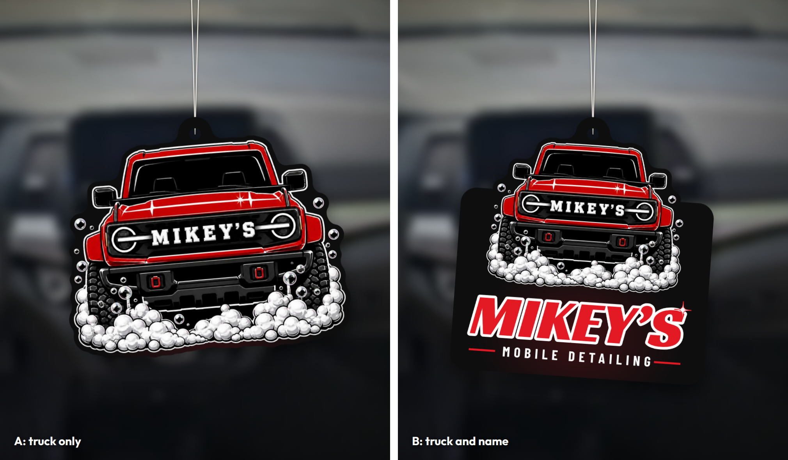
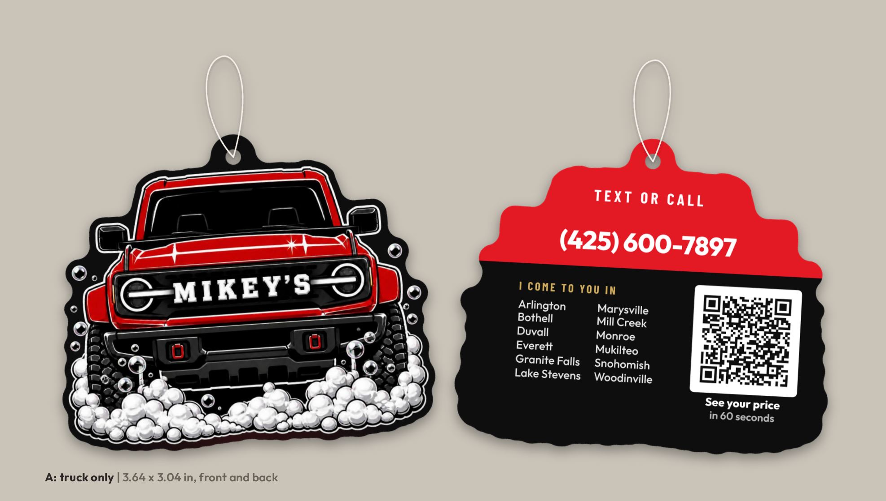
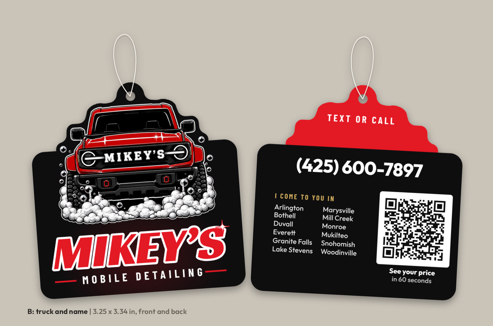

# Air freshener (die-cut, two shapes to pick from)

A paper hang-tag air freshener, cut to the logo truck, for Mikey to hand a
customer at the walk-around. There are two shapes until he picks one. Not
served (`_config.yml` excludes `print/`).

## The two shapes

| | A: truck only | B: truck and name |
|---|---|---|
| Size | 3.64 x 3.04 in | 3.25 x 3.34 in |
| Front | the logo truck, cut to its outline | the truck's roof and mirrors break out of the top of a rounded body that says MIKEY'S / MOBILE DETAILING, like the business card |
| Back | "Text or call" and the phone on the red cab, the towns and the QR on the black | "Text or call" on the red cab, the phone big on the black, the towns and the QR under it |

**B is the recommendation.** Hanging in someone's car, A says MIKEY'S on a
grille, and a passenger can't tell whether that's a detailer, a garage or a
truck club. B says MOBILE DETAILING in letters you can read from the back
seat. A is the cuter object and a little smaller.

## Why it's built this way

- **The shape is the logo truck,** the same idea as the die-cut card, so the
  card and the freshener look like one business. The cut line is generated
  from the truck, not drawn, so it can be resized without redrawing anything.
- **The back does one job: getting a call.** Three things, the most a small
  printed back carries well (`../business-card/RESEARCH.md`): the phone, the
  twelve towns (a stranger's first question is "do you come to me?") and a QR
  to the quote calculator.
- **No name line.** Mikey questioned "Detailed by Mikey" on 2026-10-05, and
  the logo already says MIKEY'S, so the line said it twice.
- **No prices, no offer, no review count.** A freshener gets used up in
  weeks, but a box of 500 sits in the van for a year. Prices can change, the
  Rain-Ready offer ends December 31, 2026, and the count will grow.
- **The string tab.** The hole (0.15 in) sits in a rounded tab above the roof,
  so it doesn't punch through the art, and it's over the middle of the roof,
  so the truck hangs level.
- **Type is 8 pt or more on the back.** Freshener board is softer and more
  absorbent than card stock, so small type spreads. Ask the printer for their
  minimum and raise it if theirs is higher.
- **The QR** is 0.85 in on A and 0.95 in on B (Vistaprint's floor for a card
  is 0.8 in), with the four-square white margin the QR standard requires.

The QR goes to `https://mikeysdetailing.com/?utm_source=freshener&utm_medium=print#booking`,
which shows in Google Analytics as **freshener / print**, apart from the
cards, hangers, postcards and signs.

## Handing them out

- **Ask before you hang one.** Some people hate scents or have allergies, and
  a strong one in a car you just cleaned can read as covering something up.
  Hold it out at the walk-around: "Want this or no?"
- **Pick a mild scent,** like New Car or something clean. Black Ice is the
  most popular, and it's strong.
- **Your own posts say a freshener only covers a smell.** Hand it over as a
  thank-you, not as part of the clean, and that stays true.
- **Hanging it on the mirror.** Some states treat things hanging from the
  mirror as blocking the view. Check Washington's rule before hanging one
  yourself. Handing it over lets them choose where it goes.

## The files

Rebuild with `cd print/tools && npm install && npm run freshener`.

| File | What it is |
|---|---|
| `print-files/a-truck/`, `print-files/b-truck-name/` | per shape: `front.pdf` and `back.pdf` (art at trim + 0.125 in bleed), `dieline.pdf` (the cut line and the hole as a magenta stroke, on the same page as the front), `dieline-front.svg` / `dieline-back.svg` (the same in vector) |
| `proof-a-*.png`, `proof-b-*.png` | the art with the cut line drawn on. Compare these with the printer's proof |
| `preview-*.png` | each side as it comes off the die |
| `mockup-a.png`, `mockup-b.png`, `mockup-car.png` | what they look like |

The back is drawn as seen from the back (mirrored), the same as the card.

The generator fails if:

- the copy has a price, an offer, the review count, "we", a quote time other
  than 60 seconds, a town he doesn't serve, licensed/insured, or an em dash
- any of the twelve towns is missing from the back
- the die would cut more than one piece (a bubble too far from the truck)
- any type is under 7 pt, runs past its column, or sits within 0.1 in of the
  cut or the hole
- "Text or call" leaves the red, the towns or the QR climb onto it, or the
  phone straddles the line
- the QR stops decoding, at 300 dpi or at 150 dpi with a blur

## Getting it made

No printer is picked yet. Search **"custom shape paper air fresheners"** and
get quotes from two or three. Ask each one:

- the **minimum order** and the price at 250 and 500
- whether a **custom shape** costs extra, and whether they keep the die on file
- their **template**: size limits, bleed, and whether they punch their own
  hole in a fixed spot (if so, it goes in the tab)
- **string colours** and the **scent list**
- their **minimum type size** on freshener board

Send them `front.pdf`, `back.pdf` and `dieline.pdf` for the shape Mikey
picks. If their size limit is smaller, change `truckW` (and `bodyW` for B) in
`SHAPES` in the generator and rebuild; the cut line follows.

**Never a tree shape.** Car-Freshner (Little Trees) owns the tree shape as a
trademark and goes after look-alikes.

Small batch first. When the sample arrives, scan the QR with two or three
phones, one of them old, in dim light, and smell it in a closed car on a warm
day before ordering the rest.

## Before printing: Mikey's calls

1. **A or B.**
2. **The grille.** `social/brand/logo-final/README.md` says the truck's grille
   is still very close to a real Ford Bronco's and should be redrawn before a
   large print run. On A the truck is the whole freshener.
3. **The scent,** from the printer's list.
