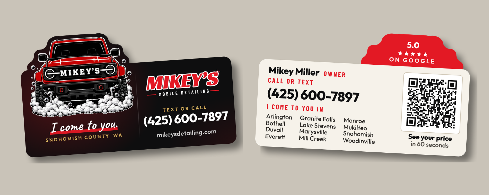

# Business card (die-cut)

A 3.5 x 2 in card that isn't a rectangle: the truck's roof and mirrors stick up
out of the top edge, cut to the truck's outline. It still fits a wallet slot
and a card holder, because the whole shape stays inside the standard 3.5 x 2
box. Not served (`_config.yml` excludes `print/`).

## Why it's built this way

Most of these go to strangers, so the card's job is to get Mikey a text.
`RESEARCH.md` in this folder has what printers, real detailers and the few
real studies say belongs on a card, with every source. What follows rests on
it.

- **The shape is the logo.** A plain rectangle with a truck printed on it looks
  like every other card. A card shaped like the truck gets noticed and gets
  kept, and people show it to each other. That shapes get kept is printer
  opinion, not data, but it's the one thing a custom die gets you, so the
  design uses it as the main idea and doesn't stop at rounded corners.
- **The back does one job, with three things.** 4OVER4's guide: a back should
  "pick two or three" things, and for a card handed to strangers the job is
  getting back to him. So the back is who he is and his phone ("Mikey
  Miller, Owner", "Call or text", the number, in that order, Mikey's layout),
  where he works (the twelve towns), and a QR to the quote calculator. The web
  address is on the front only: "Do not repeat the front."
- **The towns are a list you can look things up in.** Alphabetical, down the
  columns, at 7.5 pt. A stranger's first question is "do you come to me?",
  and none of the real detailer cards in the research answered it.
- **The bump on the back says 5.0 on Google.** On the front it's the truck. On
  the back the same shape is solid red with the rating in it. 68% of US
  consumers only use local businesses rated 4 stars or more, and most check on
  Google (BrightLocal 2026, in RESEARCH.md).
- **Nothing is smaller than 7 pt on the back.** Printers' floor is 7 pt
  (4OVER4) to 8 pt (Vistaprint, UPrinting). The first versions had the towns
  and "in 60 seconds" at 5.4 to 5.6 pt.
- **The QR is big enough to scan.** The code itself is 0.8 in (Vistaprint's
  floor), with a white margin four squares wide on every side, which is what
  the QR standard requires. The link is long (37 x 37 squares, 0.55 mm each),
  so test the printed sample with an old phone in dim light.

History, all 2026-10-01: the first back was a glovebox cheat sheet with a
"Next detail ____" line. Mikey cut it because the card has to work for
strangers, not only after a job, and the research backs him: the only back
patterns with real evidence (punch cards, appointment lines) work on existing
customers. "300+ cars" came off the front because it didn't say anything to
the person holding it. The "Online" row came off the back because the address
is on the front. Mikey then asked for his name and "Owner" at the top of the
back, over "Call or text" and the number.

## What's on it, and what's left off on purpose

Front: the truck, MIKEY'S / MOBILE DETAILING, "I come to you.", Snohomish
County, WA, "Text or call" (425) 600-7897, mikeysdetailing.com.

Back: "Mikey Miller" / "Owner", "Call or text" (425) 600-7897, "I come to you in" and the twelve
towns, a QR to the quote calculator ("See your price in 60 seconds"), and 5.0
on Google in the bump.

Left off, and the generator fails if they come back:

| Left off | Why |
|---|---|
| Prices | 500 cards sit in wallets and drawers for years and can't follow a price change. Same rule as the yard sign. |
| The Rain-Ready offer | It ends December 31, 2026. These cards last longer than that. |
| "41 reviews" | The count will grow; the card won't. |
| Licensed / insured | Still unconfirmed (CLAUDE.md). |
| Lynnwood, Edmonds | He doesn't serve them. Only the twelve towns. |

Also left off, by choice: hours (they change when school ends), a services
list and "No deposit. You pay when it's done." (both true and timeless, but a
fourth thing on the back is past the "two or three" line; RESEARCH.md
recommendation 7 has them if room is ever wanted), and a referral reward (a
new offer is Mikey's call).

The QR goes to `https://mikeysdetailing.com/?utm_source=card&utm_medium=print#booking`.
In Google Analytics that shows up as **card / print**, apart from the hangers,
postcards and signs. Nobody has independent data on how often business-card
QR codes get scanned, so after a few weeks those numbers are the only scan
data that applies to this card.

## The files

Rebuild with `cd print/tools && npm install && npm run card`.

| File | What it is |
|---|---|
| `print-files/3.5x2/front.pdf` | front art, 3.75 x 2.25 in (3.5 x 2 trim + 0.125 in bleed) |
| `print-files/3.5x2/back.pdf` | back art, same size. **Drawn as seen from the back**, so the truck bump is at the top right |
| `print-files/3.5x2/dieline.pdf` | the cut line alone, as a magenta 0.5 pt stroke, positioned on the same 3.75 x 2.25 page as the front |
| `print-files/3.5x2/dieline-front.svg`, `dieline-back.svg` | the same cut line as vector SVG (one closed path), for a printer that wants vector |
| `proof-front.png`, `proof-back.png` | the art with the cut line drawn on. Compare these with the printer's proof |
| `preview-*.png`, `mockup.png` | what the cut card looks like |
| `RESEARCH.md` | what goes on a card, front and back, with sources |

How the cut line is made: the truck from the logo is grown by 0.06 in, merged
with the rounded card body, and smoothed so no inside corner is tighter than
0.125 in, the minimum 4OVER4 asks for (steel rule dies can't follow sharp
inside corners, and the soap bubbles would be impossible to cut). Move or
resize the truck in the generator and the cut line follows; nobody redraws it
by hand.

The generator fails if:

- any of the copy rules above is broken, or an em dash shows up
- any type on the back is under 7 pt (the front's two small gold labels are
  excepted while Mikey decides; see below)
- any type sits within 0.1 in of the cut (cutting drifts about 1/32 in)
- the phone, the web address or the town list runs past its column
- the rating spills off the red bump onto the cream
- the QR stops decoding to the right link, at 300 dpi or at 150 dpi with a
  blur (a rough stand-in for a phone, not a replacement for real phones)

The front is black all the way into the bleed, and the back is cream, with red
only behind the bump, so a cut that drifts slightly shows nothing.

## Ordering

Short version in `print/ORDERING.md`. What to ask for:

- **Custom die-cut business cards**, 3.5 x 2 in, full color both sides, with
  the dieline above as the custom shape. Some printers only offer preset shapes
  (rounded corners, leaf, circle). That isn't this. It has to be a printer that
  takes **your own die line**.
- **Ask for the printer's minimum inside corner radius.** The die uses 0.125 in;
  if theirs is bigger, change `CLOSE` in the generator and rebuild.
- **Stock: 16 pt or thicker, matte or uncoated,** not soft-touch or gloss.
  Thick is what makes a card feel worth keeping, and a writable finish lets
  Mikey jot a name or a time on one when he hands it over.
- **Check the proof:** the cut line follows the truck's roof and mirrors, the
  back's red bump is at the **top right** (it's the mirror image of the front),
  and nothing important is near the edge.
- **When the sample arrives:** scan the QR with two or three phones, one of
  them old, in dim light, from about a foot away.
- **First run:** 500 is a fine first order for cards (Mikey's number,
  2026-10-01). A custom die usually adds a one-time setup charge; reorders on
  the same die are cheaper. Ask whether they keep the die on file.

## Before printing: Mikey's calls

1. **The grille.** `social/brand/logo-final/README.md` says the truck's grille
   is still very close to a real Ford Bronco's and should be redrawn before a
   large print run. On this card the truck is the whole shape, so it's the
   most visible place the grille will ever be. 500 cards is a small run, so
   this is his call, but he should make it knowing that.
2. **The front's two small labels.** "TEXT OR CALL" and "SNOHOMISH COUNTY, WA"
   are 5.6 pt, under every printer's 7 pt floor. Mikey likes the front as it
   is, so they're left alone; raising them is a one-line change each.
3. **"Snohomish County, WA" on the front.** Duvall and Woodinville are in King
   County and Bothell is split, so it doesn't cover all twelve towns.
   "Snohomish, WA" (his base) would be true for every customer. The back's town
   list already answers the question, so this is low stakes.
4. **"5.0 on Google" can go stale.** If one 1-star review lands, the average
   shows 4.9 and 500 cards disagree with Google. "Read my reviews on Google"
   never goes stale but says less.
