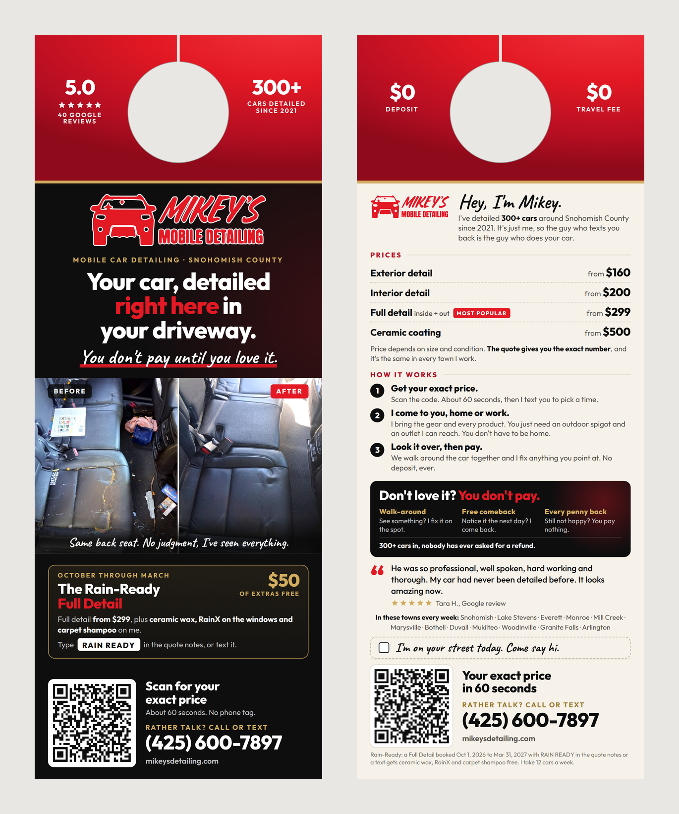

# Door hanger

Two-sided, full color, with a die-cut hole. The front has to work from the
walkway in about three seconds. The back answers the questions a stranger has
before letting someone work in their driveway: what does it cost, how does it
work, what if I don't like it.



## ⚠️ Decide one thing before printing

**Does the Rain-Ready offer go on it?** It's the offer from
`social/PLAYBOOK.md` section 3, same terms: a Full Detail booked Oct 1, 2026 to
Mar 31, 2027 with RAIN READY in the notes or a text gets ceramic wax, RainX
and carpet shampoo free ($50 of extras). The playbook still has it waiting on
your yes, and printing it on a few thousand hangers is a bigger promise than
one post.

| Your answer | Print these |
|---|---|
| **Yes** (recommended, see "Why an offer" below) | `front.pdf` + `back.pdf` |
| **No** | `front-no-offer.pdf` + `back-no-offer.pdf` (the offer box becomes "No deposit / Same guy" plus a second review; see `mockup-front-back-no-offer.png`) |

The offer version has the year on it. **A hanger with the offer is dead after
March 31, 2027**, so order what you can actually hang by then.

## Files

| File | What it is |
|---|---|
| `print-files/4.25x11-standard/` | For GotPrint, UPrinting, 4over, PsPrint, a local shop: 4.25" x 11" |
| `print-files/4.5x11-vistaprint/` | For Vistaprint, whose large hanger is 4.5" x 11" |
| `preview-*.png` | 300 dpi, trimmed, with a 1.5" hole drawn in. For looking, not printing |
| `mockup-*.png` | Front and back side by side |

Every PDF is one side, trim size plus 1/8" bleed on every edge (so the 4.25" x
11" files are 4.5" x 11.25"). Fonts are embedded, the photos are at about 400
dpi, the QR code is vector. **The hole is not in the files: the printer cuts
it.** Its size and position vary by printer (Vistaprint's is 1.18"; others run
1.25" to 1.5", centered about 1.1" down), so the top 2.2" of both sides is a
plain red band with nothing important in it, and the stats sit to the sides of
the hole where even a 1.75" hole misses them.

## Ordering it, step by step

**Vistaprint:** Marketing Materials → Door Hangers → **Large (4.5" x 11")** →
Upload your design → front: `4.5x11-vistaprint/front.pdf`, back:
`4.5x11-vistaprint/back.pdf`. In the preview, check that the hole lands inside
the red band and cuts nothing but red.

**Anyone else:** choose **4.25" x 11"**, upload `4.25x11-standard/front.pdf`
and `back.pdf`. If their template shows a hole bigger than 1.75" or lower than
2.2" from the top, stop and ask them.

**Paper:** the thickest **matte** cardstock they have (14 or 16 pt). Matte
because the back has a checkbox you tick with a pen, and ballpoint skips on
gloss (a Sharpie works on either). Thin stock flops on the knob and looks
cheap; heavier stock also stands up to damp porches better.

**Order a small batch first** (Vistaprint's minimum is 50). When it arrives:
scan both QR codes with two different phones from about a foot away, check the
reds and blacks, check the hole. Then order the thousands. A misprint on 50
costs a few dollars; on 5,000 it costs the whole run.

**How many:** start with about 2,500, hang 1,000 of them, give it three weeks,
and see what came in before reordering. Per-piece price keeps dropping with
quantity, but an untested run of 10,000 with a March 31 end date is the
expensive mistake here, not the printing.

## Hanging them

1. **Around every job, first.** While a car is being worked on, hang 20 to 30
   on the same street and the next one over, and tick "I'm on your street
   today. Come say hi." The neighbor can walk over and see the car. Home
   service businesses that do this report 3 to 5% of those hangers turning
   into jobs, against 1 to 2% for cold drops (sources below). The box is
   blank on purpose: only tick it when it's true.
2. **Then neighborhoods that fit the job:** houses with driveways (you need
   their outdoor spigot and outlet, so apartments and most condos don't work),
   two or more cars out front, SUVs and minivans (families, kids, interior
   work), and only the twelve towns printed on the back.
3. **Doorknob or door handle only. Never the mailbox, the mailbox post or
   under the flag.** That's federal law (18 U.S.C. § 1725) and the fine is per
   mailbox.
4. **Skip any house with a "No Soliciting" sign**, and gated or HOA
   communities that post a no-solicitation rule. Washington cities can enforce
   those signs.
5. **Mill Creek:** file the city's free Peddler Information Form with the City
   Clerk (cityclerk@millcreekwa.gov, 425-745-1891) before hanging there. Their
   code is written for door-to-door selling and it may not strictly apply to
   leaving a hanger, but it's free and it takes the question off the table.
   For other towns, a two-minute call to the city clerk settles it.
6. **Rain:** hang on dry days, or tuck it inside the storm door or under the
   porch roof. A soggy hanger says the opposite of "detailer".
7. **Go back to the same streets three to four weeks later.** Most people need
   to see you more than once. One industry source puts a second drop at 30 to
   40% more responses on top of the first.

## Knowing whether it worked

- **Keep a log in your phone:** date, streets, how many. When a quote comes in
  from one of those streets in the next few weeks, that's a hanger job. This
  is the most accurate count you'll get, since plenty of people will call or
  text instead of scanning.
- **Scans:** the QR goes to
  `mikeysdetailing.com/?utm_source=doorhanger&utm_medium=print#booking`, which
  lands on the quote calculator. In Google Analytics: Reports → Acquisition →
  Traffic acquisition, look for **doorhanger / print**. Sent quotes from those
  visits show up under Reports → Engagement → Events → `qqc_submission`.
- **RAIN READY in the notes** is shared with Instagram post B07 if that goes
  up, so it counts both. Ask "where did you see me?" when you text back.
- **The math to beat:** add up what the run cost (printing plus your hours
  hanging). One full detail is $299 or more. If the hangers bring in a handful
  of full details, they've paid for themselves several times over.

## Why each part is there

**The red band.** The hole has to go somewhere, so that part of the card is
made to look like a tag instead of dead space. Red is the brand color and it
stands out on white, gray and black doors alike.

**Headline: "Your car, detailed right here in your driveway."** It says what
it is (car detailing) and the one thing that makes you different (it happens
here) in the first second. "Right here" is read standing at the door of the
house it means.

**"You don't pay until you love it."** The strongest line on the website, and
a stranger's biggest worry is getting stuck paying for a bad job. It's on the
front once and explained on the back once. Same discipline as the site: say it
where people hesitate, not everywhere.

**The real before/after.** Photos of an actual job do what no sentence can.
The back seat is the most common "I'm embarrassed to book" situation, and the
caption ("No judgment, I've seen everything") answers that directly.

**Why an offer.** The playbook holds offers back on Instagram because a feed
is a relationship: give first, ask later. A door hanger gets one look and has
to earn a response on its own. The old direct mail rule (40/40/20) says who
you send it to and what you offer each matter twice as much as the design. This one adds value instead of cutting price.
Research on promotions (Diamond and Campbell, 1989) found price cuts lower the
price people expect to pay next time, while free extras don't, so $299 stays
$299. It
also has a real deadline (the rain season ends), and it pushes toward your
highest-value job, which matters when the week holds 12 cars.

**"$50 of extras", not "17% off".** Jonah Berger's Rule of 100: above $100, a
dollar amount reads as bigger than the same percentage.

**Prices on the back.** "What will this cost me?" is the question that stops
people calling. "From" prices plus "the quote gives you the exact number"
answers it honestly without printing a number that could drift from the
calculator. (It sidesteps the per-size price mismatch noted in the playbook,
same as the posts do.)

**Three steps.** Covers the practical doubts in one glance: how to book, what
you need from them (spigot and outlet), whether they have to be home (no), and
when they pay (after).

**The guarantee box and "nobody has ever asked for a refund".** The three
parts are the same as on the site. The refund line is what makes the promise
believable.

**The review.** Tara's ("my car had never been detailed before") speaks to the
person holding the hanger, who probably hasn't had a detail either.

**Two ways to respond, not six.** A QR for people who'll do it now, a phone
number for people who'd rather talk. The website is printed small, for people
who want to look you up first. No email, no Instagram handle, no Facebook:
every extra option splits attention.

**The QR code.** 1.15" on the front and 1.1" on the back, in a white box with
a full quiet zone, dark squares on light (inverted codes scan badly). The
link is kept short on purpose so the code needs fewer, bigger squares.
Every render, the generator decodes the code out of the finished image, and
again out of a blurred, darkened copy at about 95 dpi, and fails if either
doesn't come back as the exact link.

## Upgrades worth doing later

- **A photo of you.** For "a stranger in my driveway", a face is the biggest
  trust boost there is. A clear, friendly photo of you with your gear would
  replace the small logo next to "Hey, I'm Mikey." Send one and it's a
  five-minute change.
- **Licensed and insured**, once it's true (playbook section 11). It belongs
  on the back next to the guarantee.

## Changing it

Copy lives in `print/tools/build-door-hanger.cjs`. Never edit the PDFs.

```sh
cd print/tools
npm install
npm run hanger            # with the offer
OFFER=0 npm run hanger    # without it
```

The generator fails loudly if anything spills out of the safe area, if the
copy picks up an em dash, "we detail", "insured", a work day, a town Mikey
doesn't serve or a quote time other than 60 seconds, or if the QR doesn't
decode. **Every fact on the hanger is one more copy of the table in the repo's
`CLAUDE.md`**: a price or fact change lands here too. Look at the previews
before calling it done.

## Sources

- Response rates and the neighbor tactic: [4over4](https://www.4over4.com/faqs/general/what-is-the-average-response-rate-for-door-hanger-advertising),
  [ThinkFlyers benchmarks](https://thinkflyers.com/blog/door-hanger-marketing-response-rate-benchmarks-factors-and-9-ways-to-improve-2025-data),
  [Launch27](https://www.launch27.com/door-hangers/),
  [Street Feet](https://streetfeetmarketing.com/blogs/door-hanger-guides/door-hanger-marketing-response-rates),
  [PipelineOn (hangers around each job)](https://pipelineon.com/blog/window-cleaning-marketing/),
  [a cleaning business's 100-hanger test](https://www.cleaningbusinessacademy.com/local-marketing-cleaning-services-door-hanger-results/).
  These are industry blogs, not studies: treat the percentages as rough.
- Die-cut and sizes: [Vistaprint door hangers](https://www.vistaprint.com/marketing-materials/door-hangers) (4.5" x 11", 1.18" hole),
  [4over4 size guide](https://www.4over4.com/content-hub/stories/door-hanger-dimensions),
  [PrintBasics 4.25x11 template](https://printbasics.com/wp-content/uploads/2025/08/Door-Hanger-Template-4.25x11.pdf).
- QR sizing and quiet zone: [QR Code Generator](https://www.qr-code-generator.com/blog/minimum-qr-code-size/),
  [Linkbreakers benchmarks](https://linkbreakers.com/help/article/qr-code-size-and-print-dimension-benchmarks).
- Free extras vs. price cuts: [Diamond & Campbell, "The Framing of Sales Promotions", Advances in Consumer Research 16 (1989)](https://www.acrwebsite.org/volumes/6862).
- Rule of 100: [Jonah Berger](https://jonahberger.com/fuzzy-math-what-makes-something-seem-like-a-good-deal/).
- Mailboxes: [18 U.S.C. § 1725 explained](https://www.doorhangerswork.com/is-it-legal-to-put-flyers-on-doors/).
- "No Soliciting" signs in WA cities: [MRSC](https://mrsc.org/explore-topics/business-regulation/types/mobile-vendors).
  Mill Creek's form: [Solicitor/Peddler Permits](https://millcreekwa.gov/topics/solicitor-peddler-permits).
