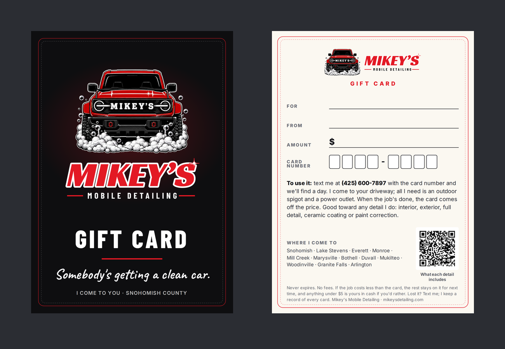

# Gift card (printed)

A 5 x 7 in card that goes in an envelope: black front with the truck and
GIFT CARD, cream back with blanks for who it's for, who it's from, the amount
and the card number. Not served (`_config.yml` excludes `print/`).

The printed card is the paper half. The number and the balance live in the
dashboard: **Work → Get Paid → Gift cards** (or **Tools → Sell a gift card**
inside the buyer's conversation). Every card sold there also has its own
printable page at its link, so a buyer who wants it right now gets the link,
and a buyer who wants something to put under the tree gets this card.

## Selling one, start to finish

1. In the dashboard, **Sell a gift card**: amount, who it's for, who it's
   from, the buyer. Paid already, or not yet.
2. Not yet: send the payment request from the card (it fills in the amount),
   and **Mark paid** when the money lands. Until then the card's link says
   "not active yet" and shows no number, so nobody can spend an unpaid card.
3. Write the dashboard's card number into the eight boxes, and the amount,
   For and From. Use a ballpoint or fine felt pen; the back is matte so it
   takes ink.
4. When the recipient texts the number, **Use a gift card**, type it in, take
   the job's price off. Whatever's left stays on the card.

When it's paid, the dashboard can log the sale in Money as income ("Gift
card"). It counts toward gross but not the job count. The job it's spent on
later was already paid for, so only log what the customer pays on top of the
card. The redeem screen says the same thing.

## Why it says what it says

- **The terms are Washington law, not a choice.** RCW 19.240.020: no
  expiration date, no fees, no dormancy charge; if a job costs less than the
  card, the rest stays available; a balance under $5 is cash on request. The
  card says exactly that, in one line. Don't add "valid for 12 months" or
  "non-refundable"; both would be unenforceable here.
- **No prices.** The card can sit in a drawer until spring, and the price
  book can move (PRICING.md). The QR goes to the quote calculator for today's
  price instead. The amount is written in by hand.
- **No Rain-Ready offer.** The offer ends December 31, 2026; a card doesn't.
- **No printed number.** The dashboard makes each number (eight letters and
  digits with no I, L, O, 0 or 1, so a number written by hand can't be
  misread). A pre-numbered stack would be a second ledger that can drift from
  the first.
- **The twelve towns and the spigot and outlet.** The recipient didn't pick
  Mikey, someone else did. The first two things they need to know are whether
  he comes to them and what he needs from them.
- **"Lost it? Text me; I keep a record of every card."** Washington doesn't
  require replacing a lost card, but the dashboard has the record (looked up
  by the buyer's or recipient's name), so it's an easy promise to keep.

## Files

| File | For |
|---|---|
| `print-files/5x7/front.pdf`, `back.pdf` | a printer: 5 x 7 + 0.125 in bleed each side |
| `print-files/letter/two-up.pdf` | home or a UPS Store: two finished backs on letter, landscape, with crop marks |
| `preview-*.png`, `mockup.png` | looking at |

Rebuild after any change: `cd print/tools && npm install && npm run gift`.
The generator fails if copy has an em dash, a price, the offer, "insured", an
unserved town, "we/our", an expiration date or a review count; if any type is
under 7 pt; if anything leaves the 0.25 in safe area; if a town or one of the
legal terms is missing; or if the QR stops decoding. Look at the previews
anyway.

## Getting them made

**This week, no order:** print `print-files/letter/two-up.pdf` on letter
cardstock (65 to 110 lb cover, matte or uncoated so a pen writes on it) at
**Actual size / 100%**, not "fit to page". Cut on the crop marks: two cards a
sheet, back only, and the back is the whole card. **A7 envelopes**
(5.25 x 7.25 in) fit a 5 x 7 card.

**Two-sided, from a printer:** Vistaprint **Stationery → Note Cards**, the
**5" x 7" flat** card, **Upload your design**: `front.pdf` as the front,
`back.pdf` as the back. Pick a **matte** stock (glossy smears ballpoint).
White envelopes come with note cards. Vistaprint takes a quantity of 1 on the
matte stocks, so order a small batch first (10 to 25) and write on one before
ordering more. Menus move; check the size reads 5" x 7" and the upload shows
the red border inside the trim line before paying. ORDERING.md has the money
rules: Mikey's card, Mikey's yes on the total.
