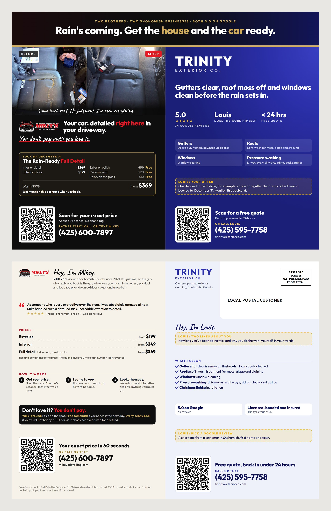

# Shared EDDM postcard: Mikey's + Trinity Exterior Co. (DRAFT)

A pitch mockup for Louis (Mikey's brother, Trinity Exterior Co.): one 11" x
8.5" card, mailed to every home on the same routes, each business on half of
each side. **Not print-ready** until Louis fills the three yellow boxes and
both brothers approve the whole card. Built 2026-09-29.

## Why the two businesses fit

- **Same customers.** Homeowners with driveways, on the same rural Snohomish
  routes.
- **Same season.** Rain is when people think about gutters, roof moss and a
  car that lives outside. The shared headline ("Rain's coming. Get the house
  and the car ready.") works for both.
- **No overlap.** Trinity cleans the house; Mikey cleans the car.
- **Both 5.0 on Google, both owner-operated, and brothers.** "Two brothers,
  two Snohomish businesses" is a trust line neither one can use alone.

## The layout

| | Left half | Right half |
|---|---|---|
| **Side 1** | Shared banner across the top. Mikey: before/after, headline, guarantee, Rain-Ready offer, QR | Trinity: name, headline, 5.0 / owner-operated / 24-hour quote, four services, **Louis's offer**, QR |
| **Side 2** | Mikey: intro (spigot and outlet), review, prices, how it works, guarantee, QR, offer fine print | Trinity: USPS postage box (top right, required on one side), "Hey, I'm Louis", what he cleans, licensed/bonded/insured, **a review**, QR |

Each business has its own QR code, phone and offer, so each counts its own
bookings. Mikey's QR goes to `mikeysdetailing.com/?utm_source=sharedcard...`,
Trinity's to `trinityexteriorco.com/?utm_source=sharedcard...`.

### What Louis needs to send

1. **His offer.** One deal with an end date, like Mikey's, ideally through
   December 31 and "mention this postcard".
2. **Two lines about himself**, in his words.
3. **One short Google review** (first name and town).
4. **His logo** as a file, if he wants it instead of the TRINITY wordmark.
5. **A before/after photo** of a roof or gutter, if he has one (optional; it
   would replace the service tiles on side 1).

Everything else on his half comes from trinityexteriorco.com (2026-09-29):
services, 5.0 across 34 Google reviews, owner-operated, free quote in under
24 hours, "licensed, bonded and insured", (425) 595-7758. He should check it.

## What it costs, split two ways

Same plan as Mikey's solo card: 1,151 homes (routes 98290-R006 and
98290-R028), mailed twice, three weeks apart.

| | Mikey alone (6.5x9) | Shared (11x8.5) |
|---|---|---|
| Printing 2,500 cards (55Printing, 14 pt gloss) | ~$307 | ~$499 ($394 + ~$105 shipping) |
| Postage: 1,151 x 2 x $0.26 | $599 | $599 (once, for both) |
| **Total** | **$906** | **$1,098** |
| **Each pays** | $906 | **$549** |

Postage is the same whatever the card carries, so sharing it is where the
savings come from.

**Break-even for each:** Mikey needs 2 full details (about $400 each).
Louis needs roughly $549 of jobs: 2 jobs if his average is about $275.

**Bigger option:** at about $1,085 each, the same card goes to four routes
(2,476 homes, all 98290), twice: 5,000 cards at ~$882 printed plus ~$1,288
postage.

### What to expect

Honestly, nobody knows how a shared card does against a solo one for a
detailer and an exterior cleaner. Each business gets half the space, so each
probably gets fewer calls than it would alone, but at half the cost. For
Mikey, 3 bookings per 1,000 cards (the realistic case in
`../postcard/README.md`) would be about 7 full details from 2,302 cards, about
$2,800, against $549.

## How the split works

- **One person pays USPS.** EDDM Retail lists one mailer on the postage form.
  Mikey pays postage and orders the printing; Louis sends his half ($549) by
  Venmo **before** anything is ordered.
- **Both approve the final PDF** and the printer's proof. Nothing prints until
  both say yes.
- **Mikey bundles and drops at the Snohomish post office**, or they split the
  two drops.
- **Around December 1, each shares his count** ("mentioned the postcard" plus
  QR scans). Then decide together: another round, more routes, or stop.
- **Each honors only his own offer.** Neither promises anything for the other.

## Timeline

| Date | Step |
|---|---|
| By Fri Oct 2 | Louis says yes and sends his offer, lines, review |
| Mon Oct 5 | Final card built, both approve, order 2,500 |
| ~Oct 14 | Cards arrive |
| **Mon Oct 19** | Drop 1 at the Snohomish post office (in homes ~Oct 21 to 29) |
| **Mon Nov 9** | Drop 2, same homes |
| ~Dec 1 | Count bookings, decide round 2 |

That's a week later than Mikey's solo plan (Oct 12), the cost of waiting for
Louis. If he can't answer by about Oct 5, Mikey mails the solo card and asks
him for the next round.

## Changing it

Copy lives in `print/tools/build-shared-postcard.cjs` (`npm run shared` in
`print/tools`). Output files end in `-DRAFT` and the run lists the
placeholders still open. Mikey's half is one more copy of the CLAUDE.md facts
table and fails the same checks as the solo card (prices, 41 reviews, 60
seconds, spigot and outlet, no "insured" on his half). The generator also
checks that neither half spills into the other, that nothing touches the
postage zone, and that all four QR codes scan.
