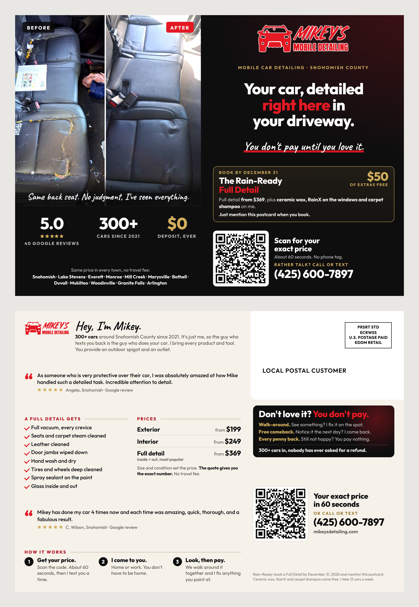

# EDDM postcard

A 6.5" x 9" postcard mailed through USPS Every Door Direct Mail (EDDM): you
pick carrier routes and the carrier puts one in every mailbox on them. No
mailing list, no permit. Built 2026-09-27.



## The offer

The Rain-Ready Full Detail, the same terms as the door hanger: **book a Full
Detail by December 31, 2026 and mention the postcard**, and ceramic wax, RainX
and carpet shampoo come free ($50 of extras). Mikey said yes to putting it on
the postcard on 2026-09-27.

Why this offer and not a bigger one: it adds value instead of cutting price,
so $369 stays $369 next time. It has a real end date (the rain season), and
it pulls people toward the highest-priced job, which matters when the week
holds 12 cars. It's also the offer already on the hangers, so nobody gets two
different deals for the same car. "Mention this postcard" is the tracking:
every booking that says it came from the mail.

**Cards with the offer are dead after December 31, 2026.** Don't print more
than the drops below can use.

## Files

| File | What it is |
|---|---|
| `print-files/6.5x9/front.pdf` | Photo side. 9.25" x 6.75" (trim plus 1/8" bleed) |
| `print-files/6.5x9/back.pdf` | Mail side, with the EDDM Retail indicia and "Local Postal Customer" already on it |
| `preview-*.png`, `mockup-front-back.png` | For looking at, not printing |

The QR goes to `mikeysdetailing.com/?utm_source=postcard&utm_medium=mail#booking`
(the quote calculator). The generator decodes it out of the finished image,
sharp and blurred, every time it runs.

## Size and printer

**6.5" x 9", 14 pt gloss, full color both sides, from 55Printing.** Postage is
the same $0.26 for every EDDM size, so the only difference is printing, and
6.5x9 is the cheapest common size that counts as a "flat" (EDDM requires a
piece taller than 6.125" or longer than 10.5"). Gloss because it's a photo
piece and nobody writes on it.

55Printing prices (from their own price file, 2026-09-27; shipping is their
estimate and the real number shows at checkout):

| Qty | 6.5x9 | 6x11 | 8.5x11 (jumbo) |
|---|---|---|---|
| 5,000 | **$429** (8.6¢) + ~$120 ship | $479 (9.6¢) | $678 (13.6¢) |
| 10,000 | **$834** (8.3¢) + ~$240 ship | $931 (9.3¢) | $1,319 (13.2¢) |

- **Jumbo 8.5x11** stands out more in the mailbox, but it's +5¢ a card, which
  is 14% more per delivered piece. Nobody has measured that a jumbo gets 14%
  more bookings for a detailer. Start at 6.5x9. Try jumbo on a later drop if
  6.5x9 works.
- **GotPrint** is the fallback. 55Printing's price file says it sets its
  prices about 2% under GotPrint's, so expect GotPrint around $850 for 10,000.
- **Vistaprint** takes the same 6.5x9 files and is the easiest upload, but
  it's usually the priciest at 10,000. Check the checkout price if you want
  the easy route.
- **Full-service EDDM** (the printer bundles the cards and drops them at the
  post office) exists at GotPrint and NextDayFlyers. It costs more and saves
  about 2 to 3 hours of bundling. Every route in the plan below drops at the
  Snohomish post office, so do it yourself.

### Ordering at 55Printing

EDDM Postcards → Size **6.5" x 9"** → Paper **14 pt Gloss** → **Full Color Both
Sides** → Quantity **10,000** → Regular turnaround (3 to 5 business days) →
Ground shipping to your address. Upload `front.pdf` as the front and
`back.pdf` as the back. If they ask about EDDM indicia, say it's already in
the file. **Approve the PDF proof only after checking**: the indicia box is top
right on the white area, and nothing is cut off at the edges.

## The $1,000 version (Mikey's budget, set 2026-09-27)

This is the plan to run. The bigger plan below is what to scale into once
this one proves itself.

**Order 2,500 cards** at 55Printing (6.5x9, 14 pt gloss, both sides, regular
turnaround): **$247 + ~$60 shipping**. 55Printing only lists 1,000, 2,500 and
5,000 at this size, and 2,500 is the best fit.

**Mail two routes twice**, three weeks apart:

| Route | Homes | Median income | Avg household | Miles |
|---|---|---|---|---|
| 98290-R006 | 584 | $178k | 2.7 | 2.1 |
| 98290-R028 | 567 | $178k | 2.7 | 3.1 |
| **Total** | **1,151** | | | |

| | |
|---|---|
| Printing + shipping | ~$307 |
| Postage, 1,151 x 2 drops x $0.26 | $599 |
| **Total** | **~$906** |
| Spare cards | ~200: hand them to customers for neighbors. Never put one in a mailbox yourself (18 U.S.C. § 1725) |

Same dates: order Sep 28, drop 1 on Mon Oct 12, drop 2 on Mon Nov 2, both at
the Snohomish post office.

**Why two routes twice, not four routes once:** people need to see you more
than once, and a single drop to strangers tells you almost nothing. The
catch: 2,302 cards is a small test, and the result will be noisy. One booking
more or less changes the picture.

| Case | Bookings per 1,000 cards | Jobs | Revenue (~$400 each) | Return |
|---|---|---|---|---|
| Weak | 1 | ~2 | ~$920 | about even |
| **Realistic** | **3** | **~7** | **~$2,760** | **~3x** |
| Strong | 6 | ~14 | ~$5,520 | ~6x |

**Break-even is 3 full details.** Around Dec 1, count them. 7 or more: scale
into the seven-route plan below. 3 to 6: it paid, so try the next two routes
before spending more. 0 to 2: stop and put the next $1,000 into Google ads.

## Where to mail: the first 4,865 homes

Real USPS route data (pulled 2026-09-27 from the same source the EDDM tool
uses). These are the seven routes out of the Snohomish post office with the
highest incomes and biggest households within 4 miles of base: rural routes,
so houses with driveways, spigots and outlets. Bigger households mean more
kids and more cars, which means back seats like the one on the card.

| Route | Homes | Median income | Avg household | Miles from base |
|---|---|---|---|---|
| 98290-R037 | 767 | $150k | 2.6 | 2.0 |
| 98290-R006 | 584 | $178k | 2.7 | 2.1 |
| 98290-R031 | 558 | $150k | 2.6 | 2.8 |
| 98290-R028 | 567 | $178k | 2.7 | 3.1 |
| 98296-R001 | 799 | $163k | 3.4 | 3.1 |
| 98296-R030 | 718 | $163k | 3.4 | 3.1 |
| 98296-R040 | 872 | $200k+ | 3.1 | 3.6 |
| **Total** | **4,865** | | | |

All seven are delivered by the **Snohomish post office**, so one drop-off
covers them. Each ZIP stays under the 5,000-a-day limit (98290: 2,476; 98296:
2,389). Counts move a little; if the EDDM tool shows more than about 5,000,
drop the last route.

Swap any route for streets you know are good (where you already have
customers, for example). Before paying, look at each route on the EDDM map
and skip one that's mostly apartments. Renters usually can't offer a spigot
and an outlet.

**Next routes if it works** (same post office, same filters): 98296-R018
(749), 98290-R011 (496), 98290-R012 (578), 98290-R036 (656), 98296-R024
(581), 98290-R039 (617), 98296-R027 (568): another 4,245 homes. After that,
Lake Stevens (26 rural routes, 19,600 homes, Lake Stevens post office).

## The plan: the same homes twice, then decide

One drop proves little: people need to see you more than once, and most mail
advice says the second and third drops do better than the first. So the test
is **two drops to the same 4,865 homes, three weeks apart.**

| Date | Step |
|---|---|
| **Mon Sep 28** | Approve the design, order 10,000 at 55Printing |
| Sep 28 to Oct 9 | Printing (3 to 5 business days) + ground shipping (1 to 6 days). Set up the EDDM account and pick the routes meanwhile |
| **Mon Oct 12** | Drop 1: bundle, pay, drop off at the Snohomish post office |
| Oct 14 to 22 | Cards land in mailboxes (USPS says 3 to 10 days, no guarantee) |
| **Mon Nov 2** | Drop 2, same routes, same cards |
| Nov 4 to 12 | Drop 2 lands |
| **Nov 16 (optional)** | Drop 3, only if the numbers below say so. Reorder 5,000 by Nov 2. Lands before Thanksgiving (Nov 26) |
| Dec 31 | Offer ends |

If the cards come early, drop early. Every week sooner is a week more before
December 31.

## What it costs and what it's likely to return

**The test (two drops):**

| | |
|---|---|
| Printing, 10,000 cards | ~$834 + ~$240 shipping |
| Postage, 4,865 x 2 x $0.26 | $2,530 |
| **Total** | **~$3,600** (about 37¢ a delivered card) |
| Your time | ~3 hours bundling per drop |

**What a booking is worth:** a Full Detail is $369 to $449; call it $400.
The offer costs you about $10 of product and 25 minutes per car. **The test
pays for itself at about 9 full details from 9,730 cards.**

Nobody can promise a response rate, so here are three honest cases. Industry
figures for cold saturation mail run from 0.1% to about 2%, and the higher
numbers come from companies that sell mail. The table counts **booked full
details**, not calls:

| Case | Bookings per 1,000 cards | Jobs from the test | Revenue | Cost per job | Return |
|---|---|---|---|---|---|
| Weak | 1 | ~10 | ~$4,000 | ~$360 | about even |
| **Realistic** | **3** | **~29** | **~$11,600** | **~$124** | **~3.2x** |
| Strong | 6 | ~58 | ~$23,200 | ~$62 | ~6.4x |

What the table leaves out: repeat business (C. Wilson has booked four times),
referrals, and the second car in the same driveway. Those are all upside. It
also leaves out your time: 29 jobs is 29 days of work you'd be doing either
way if the week isn't already full.

**The capacity ceiling:** 58 jobs over 11 weeks is 5 a week on top of what you
already have. If you're already close to 12 cars a week, the strong case
can't happen, and that's the point to stop mailing and raise prices.

### When to keep going and when to stop

Three weeks after drop 2 lands (about Dec 1), count postcard bookings:
mentions, plus `postcard / mail` in Google Analytics, plus quotes from those
routes.

- **Cost per booked job under $135** (roughly 27+ jobs): it works. Drop 3,
  then add the next seven routes, then Lake Stevens.
- **$135 to $400** (10 to 26 jobs): it pays, barely. Keep the routes, try one
  change at a time (jumbo size, a different photo).
- **Over $400** (9 or fewer): stop. Put the money into Google ads or more
  door hangers around jobs.

## Doing the drop, step by step

1. **Account:** go to eddm.usps.com and sign in or create a free USPS account.
2. **Routes:** type 98290, tick the four 98290 routes above. Type 98296, tick
   the three 98296 routes. Choose **Residential only**. The tool shows the
   count; that's how many cards you need.
3. **Mailpiece:** size 6.5 x 9, flat. Pick the drop-off date.
4. **Pay** online with a card, or pay at the counter on the day.
5. **Print the facing slips** (PS Form 3587) the tool generates: one per
   bundle, filled in with the route, and the route list for the counter.
6. **Bundle:** stacks of 50 to 100 cards, all facing the same way, no taller
   than 6", a rubber band or strap each way, a facing slip on top of each.
   Each route's bundles stay together, in a tray or a box labelled with the
   route.
7. **Drop off** at the Snohomish post office retail counter with the
   paperwork. Calling ahead on the first drop is worth it, so the counter
   expects 4,865 pieces.
8. **Write down the date** in the same phone log as the hangers.

## Knowing whether it worked

- **"I got your postcard"** in quote notes, a text or a call. Count them.
- **Scans:** Google Analytics → Reports → Acquisition → Traffic acquisition →
  **postcard / mail**. Sent quotes from those visits show up under Reports →
  Engagement → Events → `qqc_submission`.
- **Addresses:** a quote from one of the seven routes within four weeks of a
  drop is almost certainly a postcard job, even if they don't mention it.

## Why each part is there

The front works the same way as the door hanger (see
`../door-hanger/README.md`): a real before/after, "right here in your driveway",
the guarantee once, and the offer. Differences for the mail:

- **Landscape, photo on the left.** A postcard is read in the hand, not from a
  walkway, so it gets a bigger photo and three proof numbers under it.
- **The twelve towns and "no travel fee"** on the front: a card in a mailbox
  doesn't show that you were on the street, so it says where you work instead.
- **"I just detailed a car on your street" is gone.** It's only true for a
  hanger you hang by hand.
- **The spigot and outlet** are on the back in Mikey's intro. Every piece of
  print says who provides water and power.
- **Two reviews on the back.** Angela for the owner of a babied car, C. Wilson
  (four bookings) for "will he still be good the second time".

## Changing it

Copy lives in `print/tools/build-postcard.cjs`. Never edit the PDFs.

```sh
cd print/tools
npm install
npm run postcard
```

It fails if anything leaves the safe area or touches the white mail zone, if
the indicia moves outside the corner USPS allows (1.625" from the right, 1.375"
from the top), if the QR stops decoding, or if the copy picks up an em dash,
"we detail", "insured", a work day, Lynnwood or Edmonds, a quote time other
than 60 seconds, or loses the spigot and outlet line. Every fact on the card
is one more copy of the table in the repo's `CLAUDE.md`.

## Sources

- USPS EDDM rules and price: [usps.com/everydoordirectmail](https://www.usps.com/business/every-door-direct-mail.htm)
  ($0.26 Retail, 200 to 5,000 per ZIP per day, bundles of 50 to 100, indicia
  corner).
- Size rules and the July 2026 rate: [Postcards for Less](https://postcardsforless.com/guides/eddm-cost-and-requirements/),
  [Mail Movers](https://mailmovers.com/resources/2026-postage-rate-change).
- Indicia text and placement: [Catdi](https://www.catdi.com/guides/eddm/indicia-and-addressing),
  [eddm.com](https://eddm.com/eddm-indicia-requirements/).
- Printing prices: [55Printing EDDM](https://www.55printing.com/eddm-postcards-printing/)
  (their price file, 2026-09-27), [GotPrint EDDM](https://www.gotprint.com/services/eddm/info.html).
- Route counts, income and household size: USPS EDDM route service
  (`gis.usps.com/arcgis/rest/services/EDDM`), the data behind the EDDM tool.
- Response rates: [ReMail Direct](https://www.remaildirect.com/blog/every-door-direct-mail-cost)
  (EDDM 0.1 to 0.3%), [CRST](https://blog.crst.net/eddm-response-rates/)
  (home services 2 to 4%), [ANA 2025 via Mail Pro](https://www.mailpro.org/post/direct-mail-response-rates/)
  (4.4% average across all direct mail). Industry numbers, mostly from
  companies that sell mail; treat them as rough.
- Delivery window: [PostcardMania EDDM FAQ](https://www.postcardmania.com/faqs/every-door-direct-mail/).
