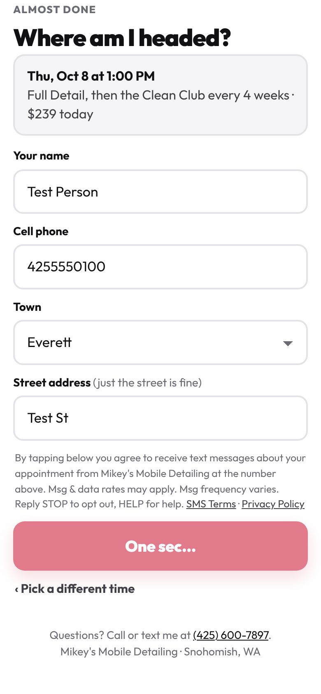
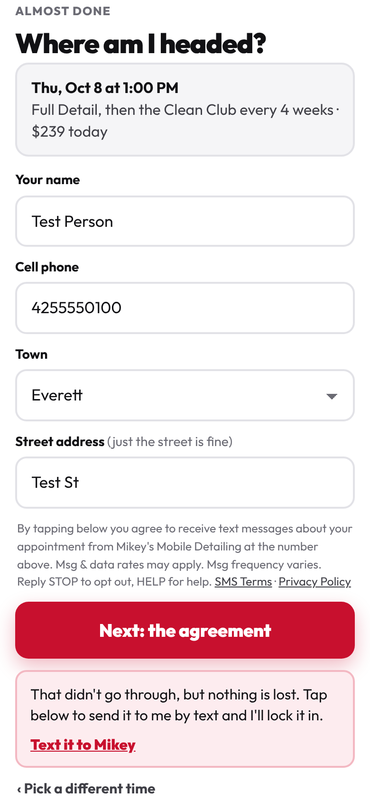

# Call page QA, October 2026

QA of `/onbored/` (and the `/onboard/` redirect) on 2026-10-06, unattended.
Tested the live page in Chromium (Playwright) at 390x844, 360x800 and 320x568.

## Read this first: the deal and the numbers

**No price, club number or term was changed.** The page's `PRICE` and `CLUB`
match the facts table and `PRICING.md`:

- `PRICE`: Full $369 / $409 / $449, Interior $249 / $289 / $329, Exterior
  $199 / $239 / $279. Condition +$30 / +$60.
- `CLUB`: $270 off, $125 a visit, keep 3, $90 each. That's the 2026-10-04 deal.

**One thing I could not check: the seven lines of terms people sign.** They
come from the dashboard worker (`clubTerms()`), and this run was not allowed to
call it or open that repo. I faked that answer to test the screen, so the
words below were not compared against the deal. Mikey, read the seven lines
once on your phone and check they say: $270 off the first Full Detail ($99 /
$139 / $179, condition on top), then $125 every 4 or 8 weeks, keep the next 3
visits or pay back $90 for each one skipped, never more than $270, and nothing
owed if they cancel before the first visit.

## What I tested

Nothing reached the dashboard. Every non-GET request was aborted, the
dashboard's GETs were answered by fakes built from the facts table, and Google
Analytics was blocked so no test showed up in your numbers. Nothing was booked,
signed, texted or sent to Stripe. The run stopped with the box ticked and a
name typed, without tapping **Sign and join**. The once-only **Book** button was
never tapped either.

What the page asks for:

| Request | Method | What for |
|---|---|---|
| fonts.googleapis.com, gstatic, gtag.js | GET | font, analytics |
| `/site-stats.js`, `/images/…` | GET | site files |
| worker `/px` (image) and `/px/e` (beacon) | GET / POST | your visit counter and step tracking |
| worker `/api/club/offer` | GET | club price and the terms for that car |
| worker `/api/next-openings` | GET | the times |
| worker `/api/book` | POST | once-only booking (not tested) |
| worker `/api/club/join` | POST | club sign-up (not tested) |
| worker `/api/club/state`, `/api/club/card` | GET / POST | the done screen and Stripe (not tested) |

The walk:

- **Every size x service x condition (27 combos)**, on Just once, Every 8 weeks
  and Every 4 weeks. Every one-time price matched the book. Every club card
  showed the Full Detail price struck through, the first visit at $270 less
  (sedan clean $99, SUV $139, van $179, condition on top), "Save $270", "$125
  a visit" and "Keep your next 3 visits".
- **The service list** prices change with the size (checked all 3).
- **Rain-Ready** shows on Full Detail and on every club card: polish, ceramic
  wax and RainX free, "$60 value" (the $30 + $20 + $10 add-on prices).
- **The pinned bottom button** can be tapped on every size, and nothing on the
  page ends up stuck under it when you scroll to the bottom.
- **No sideways scrolling** at any width, on any step.
- **Times**: 3 openings, then "See more days" shows the rest. Picking one
  carries the time and "$239 today" (the price) into the next step.
- **Name step**: town list is the twelve towns plus "Somewhere else". The name,
  car and town from your link (`?n=…&car=…&t=…`) fill in.
- **Agreement**: 7 numbered lines, number 4 in red. Tapping Sign with nothing
  filled in flags the box and the name, without sending anything.
- **Redirects**: `/onboard/`, `/onboard`, `/onboard/?x=1` and
  `/onboard/?n=Sam&car=Civic&t=everett` all land on `/onbored/` with the query
  string kept; the last one says "Hey Sam" and fills in the car.

## What happens when the dashboard is down or slow

| Situation | What the person sees | Can you finish the call? |
|---|---|---|
| Calendar down, slow or hanging | After 6 seconds at most: "My calendar won't load right now. Tell me on the phone which day works", plus a **Text me instead** link with their pick and price filled in | Yes, by text or by booking it yourself |
| Club price doesn't answer | The card shows the same numbers worked out on the page | Yes |
| Terms down (on "Next: the agreement") | "That didn't go through, but nothing is lost", plus **Text it to Mikey** | Yes, by text |
| Terms hanging | **Was broken, fixed.** See below | Now yes |
| Sign-up hanging (`/api/club/join`) | "Signing you up…" until the phone gives up | Not tested (it would send). See below |

## What I fixed

**The agreement button could stick on "One sec…" forever.** If the worker
took the request and never answered, the button stayed greyed out with no
message, mid-call. The times screen already gives up after 6 seconds; this one
had no limit. Now it gives up after 10 seconds and shows the same "nothing is
lost, text it to Mikey" box it shows when the worker is down, and the button
works again so they can retry. A worker that answers in 8 seconds still goes
straight through (tested). The error box also clears when they retry.

Before (still "One sec…" after 15 seconds) and after:

 

No words of the deal or the terms changed. The harness is
`2026-10-call-page-qa/qa.cjs` if anyone wants to rerun it.

## What Mikey has to decide

1. **Read the seven terms lines** once on your phone (see the top). This run
   couldn't see the real ones.
2. **"$79 less than booking them apart" is only true for a sedan.** The Full
   Detail button on step 2 says it for every size. For an SUV or pickup it's
   $119 less ($289 + $239 vs $409), for a van or 3-row $159 ($329 + $279 vs
   $449). It undersells the bigger cars. I didn't change it (it's a number in
   the copy). Want it to follow the size?
3. **With the calendar down, a club sign-up can't be finished on the page.**
   Signing needs a time picked first. The fallback is the text link, so you'd
   take the details by text and sign them up later. Fine as is, or should the
   page let them sign and pick a time afterwards?
4. **"Sign and join" has no time limit.** If the worker hangs there, the person
   sees "Signing you up…" until the phone gives up. I didn't add one, because
   a sign-up that timed out on the phone may still have saved on the worker,
   and telling them "it didn't go through" could get the same person signed up
   twice. The fix belongs in the dashboard (a sign-up that's safe to send
   twice); say if you want it.

Smaller things, no action needed:

- At 320 px wide (iPhone SE first generation) "SAVE $270 ON YOUR FIRST VISIT"
  wraps onto two lines inside the red badge. Still easy to read; left alone.
- Before they've typed a name, the text-me link starts "Hi Mikey, it's me."
  Fine for a call where you know who it is.
